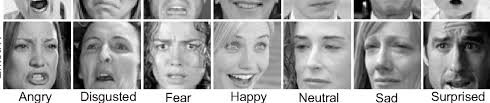
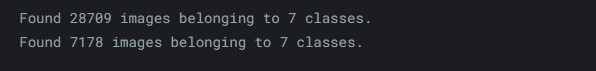
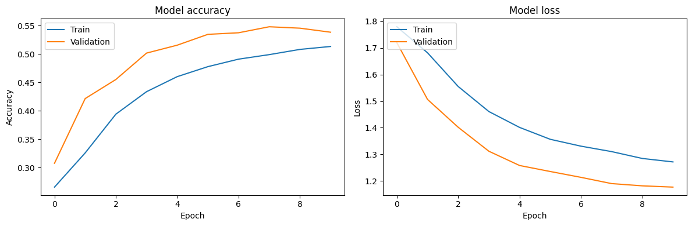
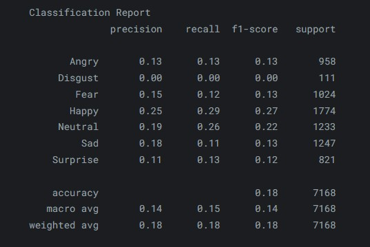
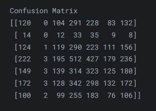
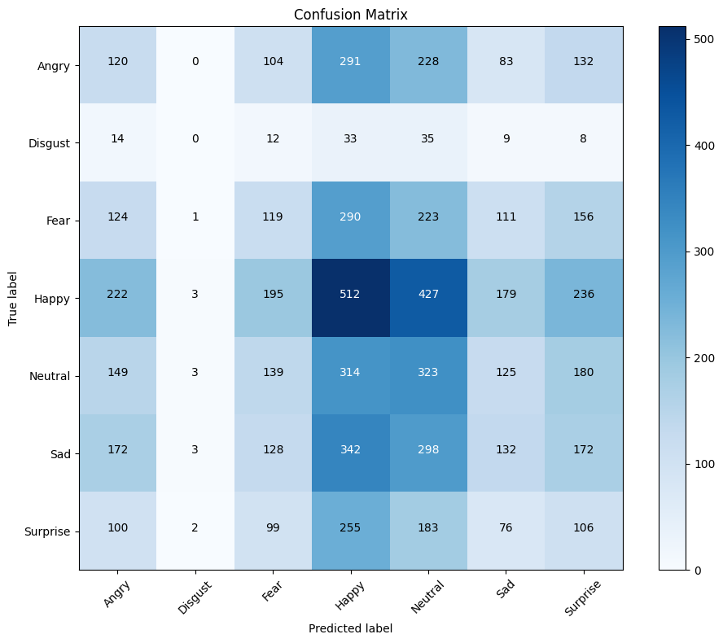

# Facial_Expression_Recognition
<div align="center">
    <a></a>
</div>
This code implements a facial expression recognition model using the Keras framework with TensorFlow. Here's a detailed explanation of each step in the code:

### Importing Libraries
```python
from tensorflow.keras.preprocessing.image import ImageDataGenerator
from tensorflow.keras.models import Sequential
from tensorflow.keras.layers import Dense, Dropout, Flatten
from tensorflow.keras.layers import Input, Conv2D, MaxPooling2D
import os
import itertools
import matplotlib.pyplot as plt
from sklearn.metrics import confusion_matrix
```
These imports include the necessary libraries for image preprocessing, building the neural network model, plotting graphs, and evaluating the model's performance.

### Data Preprocessing
```python
train_data_dir = '/kaggle/input/fer2013/train'
validation_data_dir = '/kaggle/input/fer2013/test'
```
These lines define the directories containing the training and validation data.

```python
train_datagen = ImageDataGenerator(
    rescale=1./255,
    rotation_range=30,
    shear_range=0.3,
    zoom_range=0.3,
    horizontal_flip=True,
    fill_mode='nearest'
)

validation_datagen = ImageDataGenerator(rescale=1./255)
```
These `ImageDataGenerator` objects are used to generate batches of images with augmentations (rotation, zoom, etc.) for training. The `rescale=1./255` normalizes pixel values to the range [0, 1].

```python
train_generator = train_datagen.flow_from_directory(
    train_data_dir,
    color_mode='grayscale',
    target_size=(48, 48),
    batch_size=32,
    class_mode='categorical',
    shuffle=True
)

validation_generator = validation_datagen.flow_from_directory(
    validation_data_dir,
    color_mode='grayscale',
    target_size=(48, 48),
    batch_size=32,
    class_mode='categorical',
    shuffle=True
)
```
These lines create generators to iterate over the training and validation images in batches. The images are converted to grayscale and resized to 48x48 pixels.
<div align="center">
    <a></a>
</div>
### Creating the CNN Model
```python
model = Sequential()

model.add(Input(shape=(48,48,1)))
model.add(Conv2D(32, (3, 3), activation='relu'))
model.add(Conv2D(64, kernel_size=(3, 3), activation='relu'))
model.add(MaxPooling2D(pool_size=(2, 2)))
model.add(Dropout(0.1))

model.add(Conv2D(128, kernel_size=(3, 3), activation='relu'))
model.add(MaxPooling2D(pool_size=(2, 2)))
model.add(Dropout(0.1))

model.add(Conv2D(256, kernel_size=(3, 3), activation='relu'))
model.add(MaxPooling2D(pool_size=(2, 2)))
model.add(Dropout(0.1))

model.add(Flatten())
model.add(Dense(512, activation='relu'))
model.add(Dropout(0.2))

model.add(Dense(7, activation='softmax'))
```
This model is a convolutional neural network (CNN) consisting of several layers:
- **Conv2D**: Convolutional layers to extract features from images.
- **MaxPooling2D**: Pooling layers to reduce dimensionality.
- **Dropout**: Layers to prevent overfitting by randomly deactivating some neurons.
- **Flatten**: Flattens the output from convolutional layers to send it to a dense layer.
- **Dense**: Fully connected layers, with the last layer having 7 neurons (one for each facial expression class), using the softmax activation function.

```python
model.compile(optimizer='adam', loss='categorical_crossentropy', metrics=['accuracy'])
```
The model is compiled with the Adam optimizer and the `categorical_crossentropy` loss function, used for multiclass classification.

### Training the Model
```python
history = model.fit(
    train_generator,
    steps_per_epoch=num_train_imgs // 32,
    epochs=10,
    validation_data=validation_generator,
    validation_steps=num_test_imgs // 32
)
```
The model is trained for 10 epochs using data generated by `train_generator`, and validated using `validation_generator`.

### Plotting Learning Curves
```python
plt.figure(figsize=(12, 4))

# Plot training & validation accuracy values
plt.subplot(1, 2, 1)
plt.plot(history.history['accuracy'])
plt.plot(history.history['val_accuracy'])
plt.title('Model accuracy')
plt.xlabel('Epoch')
plt.ylabel('Accuracy')
plt.legend(['Train', 'Validation'], loc='upper left')

# Plot training & validation loss values
plt.subplot(1, 2, 2)
plt.plot(history.history['loss'])
plt.plot(history.history['val_loss'])
plt.title('Model loss')
plt.xlabel('Epoch')
plt.ylabel('Loss')
plt.legend(['Train', 'Validation'], loc='upper left')

plt.tight_layout()
plt.show()
```
These lines generate plots showing the evolution of the model's accuracy and loss during training and validation.
<div align="center">
    <a></a>
</div>
### Evaluating the Model
```python
eval_result = model.evaluate(validation_generator, steps=validation_steps)
print(f"Validation Loss: {eval_result[0]}")
print(f"Validation Accuracy: {eval_result[1]}")
```
The model is evaluated on the validation data, and the results are printed.

### Prediction and Performance Evaluation
```python
Y_pred = model.predict(validation_generator, steps=validation_steps)
y_pred = np.argmax(Y_pred, axis=1)

y_true = validation_generator.classes[:len(y_pred)]
from sklearn.metrics import classification_report
print('Classification Report')
print(classification_report(y_true, y_pred, target_names=class_labels))
```
The model's predictions are compared to the true labels, and a classification report is generated, showing precision, recall, and F1-score for each class.
<div align="center">
    <a></a>
</div>

### Confusion Matrix
```python
conf_matrix = confusion_matrix(y_true, y_pred)
plt.figure(figsize=(10, 8))
plt.imshow(conf_matrix, interpolation='nearest', cmap=plt.cm.Blues)
plt.title('Confusion Matrix')
plt.colorbar()
tick_marks = np.arange(len(class_labels))
plt.xticks(tick_marks, class_labels, rotation=45)
plt.yticks(tick_marks, class_labels)

fmt = 'd'
thresh = conf_matrix.max() / 2.
for i, j in itertools.product(range(conf_matrix.shape[0]), range(conf_matrix.shape[1])):
    plt.text(j, i, format(conf_matrix[i, j], fmt),
             horizontalalignment="center",
             color="white" if conf_matrix[i, j] > thresh else "black")

plt.ylabel('True label')
plt.xlabel('Predicted label')
plt.tight_layout()
plt.show()
```
The confusion matrix is plotted to visualize the model's classification errors.

<div align="center">
    <a></a>
</div>
<div align="center">
    <a></a>
</div>
### Saving the Model
```python
model.save('/kaggle/working/model_file_10.h5')
```
The trained model is saved as `model_file_10.h5` for later use.

---

In summary, this code develops a facial expression recognition model using CNN, trains it, evaluates it, and saves the trained model.


***

***

This code implements a real-time facial expression detection and recognition application from a video stream (e.g., a webcam). The model used for facial expression recognition has been previously trained and saved in a file called `model_file_30epochs.h5`.

Here is a detailed explanation of the code:

### Importing Libraries
```python
import cv2
import numpy as np
from keras.models import load_model
```
- `cv2`: The OpenCV library used for video capture, face detection, and image processing.
- `numpy`: Used for manipulating data arrays.
- `load_model` from Keras: Used to load the saved neural network model.

### Loading the Model and Initializing Video Capture
```python
model = load_model('model_file_30epochs.h5')
video = cv2.VideoCapture(0)
```
- The facial expression recognition model is loaded from the file `model_file_30epochs.h5`.
- Video capture is initialized with `cv2.VideoCapture(0)`, where `0` indicates the default webcam.

### Configuring Video Writer
```python
frame_width = int(video.get(cv2.CAP_PROP_FRAME_WIDTH))
frame_height = int(video.get(cv2.CAP_PROP_FRAME_HEIGHT))
fps = video.get(cv2.CAP_PROP_FPS)

output_filename = 'output.mp4'
fourcc = cv2.VideoWriter_fourcc(*'mp4v')
video_writer = cv2.VideoWriter(output_filename, fourcc, fps, (frame_width, frame_height))
```
- The width (`frame_width`), height (`frame_height`), and frames per second (`fps`) of the video stream are obtained.
- A `VideoWriter` object is created to save the video to a file `output.mp4` using the `mp4v` codec.

### Face Detection and Expression Recognition
```python
faceDetect = cv2.CascadeClassifier('haarcascade_frontalface_default.xml')
labels_dict = {0:'Angry', 1:'Disgust', 2:'Fear', 3:'Happy', 4:'Neutral', 5:'Sad', 6:'Surprise'}
```
- A cascade classifier based on Haar cascades is loaded to detect faces in the images. The file `haarcascade_frontalface_default.xml` contains the necessary classification data.
- A dictionary `labels_dict` maps the indices of the model's output classes to their corresponding facial expression names.

### Main Loop for Video Processing
```python
while True:
    ret, frame = video.read()
    gray = cv2.cvtColor(frame, cv2.COLOR_BGR2GRAY)
    faces = faceDetect.detectMultiScale(gray, 1.3, 3)
```
- The video stream is continuously read.
- Each frame is converted to grayscale as face detection is more effective on grayscale images.
- `detectMultiScale` detects faces in the image, returning the coordinates of the rectangles bounding each face.

### Preprocessing and Prediction
```python
    for x, y, w, h in faces:
        sub_face_img = gray[y:y+h, x:x+w]
        resized = cv2.resize(sub_face_img, (48, 48))
        normalize = resized / 255.0
        reshaped = np.reshape(normalize, (1, 48, 48, 1))
        result = model.predict(reshaped)
        label = np.argmax(result, axis=1)[0]
```
- For each detected face, the face image is extracted, resized to 48x48 pixels, normalized (values between 0 and 1), and reshaped to match the model's expected input (1, 48, 48, 1).
- The model predicts the facial expression of the face. The predicted class is obtained by taking the index of the maximum probability (`np.argmax`).

### Displaying Results
```python
        cv2.rectangle(frame, (x, y), (x+w, y+h), (0, 0, 255), 1)
        cv2.rectangle(frame, (x, y), (x+w, y+h), (50, 50, 255), 2)
        cv2.rectangle(frame, (x, y-40), (x+w, y), (50, 50, 255), -1)
        cv2.putText(frame, labels_dict[label], (x, y-10), cv2.FONT_HERSHEY_SIMPLEX, 0.8, (255, 255, 255), 2)
```
- Three rectangles are drawn around the detected face:
  - The first to mark the face region.
  - The second to add thickness.
  - The third, filled, is positioned above the face to display the text.
- The displayed text is the predicted facial expression, obtained from `labels_dict`.

### Recording and Display
```python
    video_writer.write(frame)
    
    k = cv2.waitKey(1)
    if k == ord('q'):
        break
```
- Each frame is written to the video file via `video_writer`.
- If the 'q' key is pressed, the loop terminates.

### Releasing Resources
```python
video.release()
video_writer.release()
cv2.destroyAllWindows()
```
- The video capture and writer are released, and all windows created by OpenCV are closed.

### Summary
This code uses a real-time video stream to detect faces, predict their facial expressions using a pre-trained CNN model, display the results on the video in real-time, and save the video to an MP4 file.
